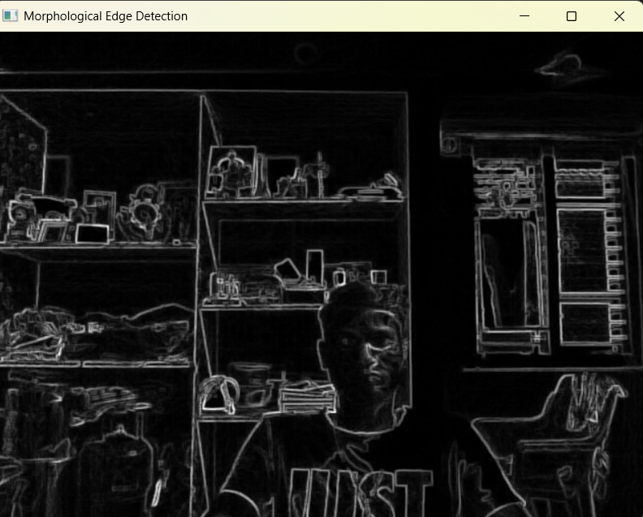

# EDGE_DETECTION-morphological-method-
This Python script performs real-time edge detection on webcam video using morphological image processing techniques. It first converts each video frame to grayscale, then applies dilation and erosion using a rectangular kernel. The difference between the dilated and eroded images forms the morphological gradient, which highlights the edges in the scene. The resulting gradient image is normalized and displayed in a window for visualization. This method provides a simple yet effective way to detect object boundaries and can be useful for various computer vision applications.

## Features

- **Morphological Edge Detection**: Uses dilation and erosion to compute the morphological gradient, highlighting edges in the frame.
- **Real-Time Processing**: Captures video from the webcam and processes each frame in real-time.
- **Interactive Display**: Displays the processed edges in a separate window, which updates continuously.

## Requirements

- Python 3.x
- OpenCV (`cv2`)
- NumPy (`numpy`)

## Installation

1. Clone this repository or download the script.
2. Install the required Python libraries:
   ```bash
   pip install opencv-python numpy
   ```

## Usage

1. Run the script:
   ```bash
   python edge1.py
   ```
2. The program will open the default webcam and start processing frames.
3. Press the `q` key to exit the program.

## Code Explanation

### `morphological_edge_detection(frame, kernel_size=(3, 3))`

This function performs morphological edge detection on a given frame:
- Converts the frame to grayscale.
- Creates a structuring element (kernel) of the specified size.
- Applies dilation and erosion to the grayscale image.
- Computes the morphological gradient by taking the absolute difference between the dilated and eroded images.
- Normalizes the gradient to the range `[0, 255]` for better visualization.

### `main()`

The main function:
1. Opens the default webcam using `cv2.VideoCapture(0)`.
2. Continuously captures frames from the webcam.
3. Applies the `morphological_edge_detection` function to each frame.
4. Displays the processed edges in a window titled "Morphological Edge Detection".
5. Exits the loop and releases resources when the `q` key is pressed.

## Example Output

When the program is running, you will see a window displaying the edges detected in the video stream. The edges are computed using morphological operations, which highlight the boundaries of objects in the frame.


## Notes

- Ensure that your webcam is connected and accessible.
- You can adjust the kernel size in the `morphological_edge_detection` function to modify the sensitivity of edge detection.

